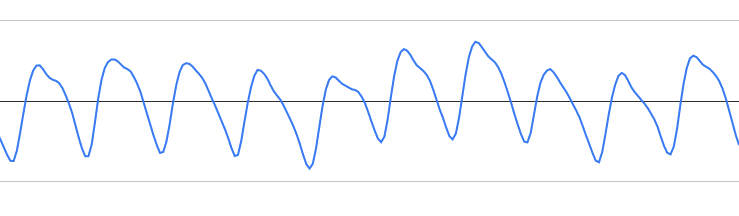

# Sub-G Smart ECG PPG

---

<table>
<tr align="center">
  <td> TOP </td>
</tr>
  <tr align="center">
    <td></td>
  </tr>
  <tr align="center">
    <td> BOTTOM </td>
  </tr>
    <tr align="center">
      <td></td>
    </tr>
</table>

----

Sub-G Smart ECG PPG collects key vital signs information such as ECG, heart rate, SPO2, and temperature using AxDen's Aggregator Platform.
 
This is an example that provides quick testing of various service scenarios that require long-distance communication of 1Km or more.
 

----

Device can be purchased from the Naver Smart Store.
 

[Purchase Link : naver smart store](https://smartstore.naver.com/axden)
 
 

You can purchase it by contacting sales@axden.io

----

### Key feature and functions

MCU | Description
:-------------------------:|:-------------------------:
CC1312R1 | TI ROTS, EasyLink

* Low-power technology with TI Sensor Controller is available in the Production version family.

Sensors | Description
:-------------------------:|:-------------------------:
MAX30003 | ECG, Heart rate sensor
MAX30101 | SPO2, Heart rate sensor
SI7051 | Temperature sensor

*If you need a body temperature measurement, please contact development@axden.io.*

The Sub-G Smart ECG PPG example collects and transmits key vital signs information such as ECG (Ecardiogram), Heartrate (Heart Rate), SPO2 (Oxygen Saturated), and Temperature using Sub-G long-distance communication.
 
 
Interwork with the AxDen Aggregator Platform to check sensor information on the Web and Mobile without building infrastructure such as servers and DBs.
 
 
Learn Edge AI using sensor information stored in the AxDen Aggregator Platform.
 

----

#### How to check using the terminal.

If you have an AA-MB-05 board, you can check the communication through the terminal.
 
 
Connect the AA-MB-05 board to the PC.
 
 
Baudrate is 9600.
<table>
  <tr align="center">
    <td>RF RX example terminal</td>
    <td>RF TX example terminal</td>
  </tr>
  <tr align="center">
    <td></td>
    <td></td>
  </tr>
  <tr align="center">
    <td>ECG Graph</td>
    <td>PPG Graph</td>
  </tr>
  <tr align="center">
    <td></td>
    <td></td>
  </tr>
</table>

----

#### How to check using AXDEN Aggregator Platform

Register the MAC Address of the device after signing up as a member on the AXDEN Aggregator Platform website.
 

Enter COMPANY ID nad DEVCIE ID provided on the AXDEN Aggregator Platform website into COMPANY_ID and DEVCIE_ID in the Protocol.h header file.
 

[AXDEN Aggregator Platfrom](http://project.axden.io/)
 

`#define COMPANY_ID 0`
 

`#define DEVICE_TYPE 0`
 

Complie and flash.
 
 
Check whether COMPANY_ID and DEVICE_ID are applied correctly through the terminal
 
 

Sensor information can be found on the Web or Mobile.
 

----

### Hardware Pinmap

You can check in the board_define.h header file.

----

### [Firmware settings and compilation](https://github.com/AxDen-Dev/CC1312R1_Ping_Pong_example_gcc)

----

### [Firmware flash](https://github.com/AxDen-Dev/CC1312R1_Ping_Pong_example_gcc)

